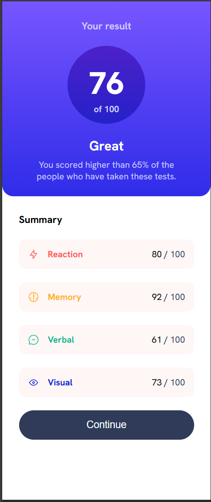
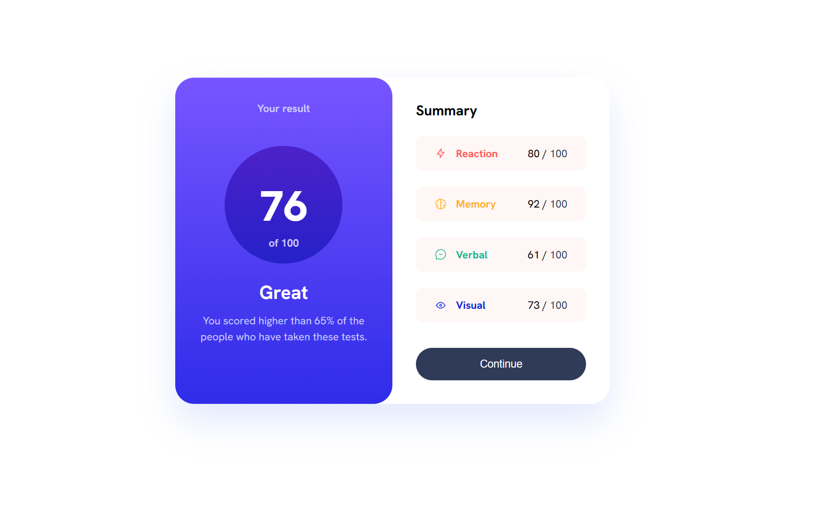

# Results summary component — solution

This repository contains my solution to the "Results summary component" challenge from Frontend Mentor.

Live demo: (https://fmresultscomponent.netlify.app/)

## Screenshots

- Desktop / wide layout

	

- Mobile / narrow layout

	

## Features

- Mobile-first responsive layout that switches to a two-column layout on tablet and larger screens.
- Accessible semantic HTML and focus states for interactive controls.
- Local `data.json` available to populate the summary content.

## Getting started

### Prerequisites

- Node.js (16+) and npm

### Install and run locally

```powershell
npm install
npm run dev
```

### Build for production

```powershell
npm run build
npm run preview
```

## Project structure (important files)

- `index.html` – app entry HTML
- `src/main.jsx` – React entry
- `src/App.jsx` – main component and layout
- `src/index.css` – project styles (mobile-first + media queries)
- `src/data.json` – sample data used for summary items
- `src/assets/` – images and fonts used by the UI
- `package.json` – scripts and dependencies (Vite + React)

## Implementation notes

- Styling is mobile-first. A media query at 768px switches the layout to a side-by-side (row) layout and scales spacing, font sizes, and border radii as the screen grows.
- The body centers the app; the main `.container` has a max-width and gains padding on larger screens so the component appears like a centered card.
- Fonts: the project loads the Hanken Grotesk variable font from Google Fonts and also includes local font files under `src/assets/fonts/`.
- Data: `src/data.json` contains the summary entries and can be wired into the component to render the cards dynamically instead of hard-coded values.

## How to customize

- To change colors or spacing, edit `src/index.css`.
- To change the summary values, update `src/data.json` or modify `src/App.jsx` to read from that file.

## Deployment

Deploy this Vite + React app to Netlify, Vercel, or GitHub Pages. For Vercel, connect the repository and use the default build command `npm run build`.

## Author

- Juan Vallejo
- Frontend Mentor: [CiaoGab](https://www.frontendmentor.io/profile/CiaoGab)
- GitHub: [CiaoGab](https://github.com/CiaoGab)

## Acknowledgments

Thanks to Frontend Mentor for the design and starter assets used in this challenge.
